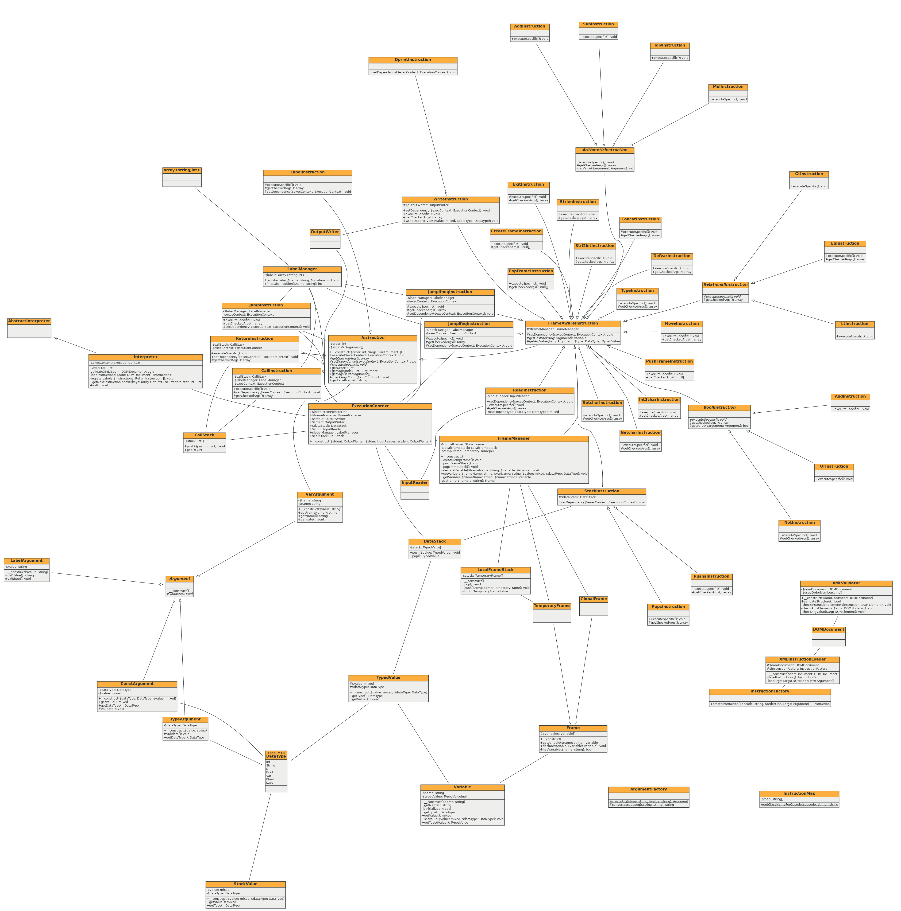

Implementační dokumentace k 2. úloze do IPP 2023/2024\
Jméno a příjmení: Jakub Jeřábek\
Login: xjerab28

## Řešení úkolu
Hlavní třídou programu je _Interpreter_ v souboru _Interpreter.php_, dědící od _AbstractInterpreter_. Tato třída využívá další třídy k načtení a vyparsování XML souboru a provádění jednotlivých instrukcí v jednoduchém _while_ cyklu. Činnost interpretu by se dala popsat v několika krocích:
1. Načtení vstupního XML souboru
2. Parsování vstupu s kontrolou struktury a převodem na odpovídající instance
3. Provádění _execute_ instrukce, na kterou ukazuje _instruction pointer_
4. Instrukce získá odpovídající argumenty, provede kontrolu typů, počtu argumentů atd.
5. Vykonání instrukce (interpretace kódu)

## Struktura repozitáře
- **Arguments** - obsahující abstraktní třídu _Argument_ a třídy dědící z této třídy, dle jednotlivých typů argumentů
- **Enums** - výčtové typy, obsahující pouze _DataType_ pro určení datového typu
- **Exception** - vlastní třídy výjimek, dědící z _IPPException_
- **Factory** - třídy implementující návrhový vzor _tovární metoda_, k vytvoření potřebné instance
- **Frame** - obsahující abstraktní třídu _Frame_ a konkrétní třídy z této třídy dědící
- **Instructions** - obsahující abstraktní třídu _Instruction_ a další abstraktní třídy, dle typu instrukce a až následně konkrétní specializace.
- **Managers** - obsahuje správce rámce a návěští
- **Stacks** - obsahující třídy, pracující se zásobníkem
- **Values** - třídy, struktury určené k přenosu dat zejména proměnných a jednotlivých hodnot
- **XML** - obsahuje třídy k validaci XML vstupního souboru a k vyparsování, načtení tohoto vstupu
- **ExecutionContext.php** - kontejner, který obsahuje všechny důležité instance, potřebné k fungování všech instrukcí a celého interpretu. Je předáván každé instrukci, která si z tohoto kontejneru vybere pouze ty, které potřebuje k provedení.
- **InstructionMap.php** - seznam všech instrukcí k jednoduchému vytvoření instrukce v továrně
- **Interpreter.php** - hlavní třída, inicializující _ExecutionContext_ a provádění instrukcí ve while cyklu, dle instrukčního ukazatele

## Využité návrhové vzory

Jak zmíněno v předchozí sekci, ve třídách s názvem _Factory_ byl využit návrhový vzor **tovární metody**, který umožňuje efektivně vytvářet instance podle například názvu instrukce, nebo formátu argumentu. V případě vytváření instrukcí je použita _InstructionMap_, která obsahuje asociativní pole, které jako klíče obsahují název instrukce a jako hodnotu klíče název jejího jmenného prostoru.

Další návrhový vzor byl použit u instrukcí a to **šablonová metoda**, kde všechny instrukce mají jednotné rozhraní a všechny musí mít definovaný určitý krok. Konkrétně, každá instrukce potřebuje přístup k instanci třídy, zajišťující fungování interpretu - rámce, zásobník, ukazatel na instrukce apod. Musí tedy implementovat metodu _setDependency_, která z předaného _ExecutionContext_ si tuto potřebnou instanci "vybere". Dále musí implementovat _executionSpecific_, kde už pouze získá argumenty a vykoná příslušnou instrukci. Veřejně přístupná je pouze metoda _execute_, která tyto dvě abstraktní metody vykonává. Tím je zajištěno jednotné rozhraní pro každou instrukci.

## Implementace tříd instrukcí

Aby bylo docíleno co nejlepšího objektově-orientovaného přístupu a minimalizaci jakéhokoliv kopírování kódu, či duplikaci podobné logiky, byly kromě abstraktní třídy _Instruction_ vytvořené další dědící abstraktní třídy, dle typů instrukcí. Konkrétně to jsou:
- **FrameAwareInstruction** - implementující získání proměnné z rámce a získání hodnoty argumentu
- **StackInstruction** - pouze nastavující přístup k zásobníku a rámcům, rozšiřující _FrameAwareInstruction_
- **RelationInstruction** - rozšiřující _FrameAwareInstruction_ a implementující získání argumentů instrukce (pro všechny relační instrukce je způsob jejich získání stejný)
- **BoolInstruction** - stejný důvod existence jako _RelationInstruction_
- **ArithmeticInstruction** - stejný důvod existence jako výše

## Přílohy

Obrázek 1: Diagram tříd vygenerovaný pomocí nástroje phuml